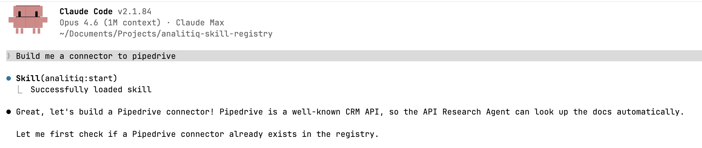

# sevdesk

Connector for the [sevdesk](https://sevdesk.de) cloud accounting and invoicing API. sevdesk is a cloud-based accounting and invoicing platform for small businesses and freelancers in the DACH region. This connector provides access to check account transactions (bank payments) with more endpoints planned.

## What is this?

This is a **connector** -- a configuration that defines how to authenticate with sevdesk and what data endpoints are available for reading. It does not move data by itself. Instead, it is used by the [Analitiq](https://analitiq-app.com) data integration platform or the open-source `analitiq-core` engine to set up data pipelines.

## How to use this connector

There are two ways to use this connector:

### Option 1 -- Analitiq Cloud (no setup required)

All connectors from this registry are automatically available on [analitiq-app.com](https://analitiq-app.com). Simply log in, select the connector, and follow the on-screen instructions to connect your account.

### Option 2 -- Open Source (self-hosted)

All connectors are open source and free to use. To get started:

1. Clone the [analitiq-core](https://github.com/analitiq-dip-registry/analitiq-core) repository
2. Install the Claude plugin `analitiq-plugin-dataflow`
3. Launch Claude in the root directory of `analitiq-core`
4. Tell it: *"I need to move data from X to Y"*

The `analitiq-plugin-dataflow` plugin will automatically fetch the required connectors from the [Analitiq DIP Registry](https://github.com/analitiq-dip-registry) and set up the data flow pipeline for you.

## Prerequisites

- A sevdesk account at [my.sevdesk.de](https://my.sevdesk.de)
- An API token (32-character hexadecimal string) generated from Settings > Users > select a user

## Authentication

sevdesk uses a **Personal API Token** for authentication. The token is sent as-is in the `Authorization` header (no `Bearer` prefix). No OAuth app registration is required. The token has infinite lifetime and does not expire unless manually revoked.

### How to get your credentials

1. Log in to your account at [my.sevdesk.de](https://my.sevdesk.de)
2. Navigate to **Settings > Users**
3. Select the user whose API token you want to use
4. Copy the 32-character hexadecimal API token
5. Paste the token into the "API Token" field when creating a connection

## Available Endpoints

The table below lists all data endpoints defined by this connector. Each endpoint represents a resource you can read from.

| Endpoint | Method | Description |
|----------|--------|-------------|
| `/CheckAccountTransaction` | GET | Retrieve check account transactions (bank payments) |

## Limitations

- **Rate limits** -- Not documented by sevdesk. No rate limit configuration is applied.
- **Pagination** -- Offset-based with a maximum page size of 1000 records.
- **Timeout** -- 30 seconds per request.
- **Auth header format** -- The `Authorization` header uses the raw API token without a `Bearer` prefix, which differs from most API key connectors.

## For AI agents

This connector includes `CLAUDE.md` and `AGENTS.md` files -- machine-readable references used by AI agents and agentic frameworks. They document authentication types, available endpoints, post-auth steps, and any caveats for programmatic use. Both files are kept identical -- `CLAUDE.md` is for Claude Code, `AGENTS.md` is for other agent frameworks.

## Create a connector to any system

You can create a new connector to any API or database using Claude and the Analitiq connector builder plugin:

1. Install [Claude Code](https://claude.ai/code)
2. Install the connector builder plugin:
   ```
   claude plugin add analitiq-dip-registry/analitiq-plugin-connector-builder
   ```
3. Launch Claude and say: *"I want to create a connector for [system name]"*
4. The plugin will interview you about the system, research its API documentation, and generate the full connector with all required files

No coding required -- the plugin handles authentication research, endpoint schema generation, and file creation automatically.



## Contributing

All connectors in this registry are community-maintained and live at [github.com/analitiq-dip-registry](https://github.com/analitiq-dip-registry). To add new endpoints or improve an existing connector, install the [connector builder plugin](https://github.com/analitiq-dip-registry/analitiq-plugin-connector-builder) and follow its instructions.

## Links

- [sevdesk API Documentation](https://api.sevdesk.de/)
- [sevdesk API News](https://tech.sevdesk.com/api_news/)
- [Analitiq Cloud](https://analitiq-app.com)
- [Analitiq Engine (open source)](https://github.com/analitiq-dip-registry/analitiq-engine)